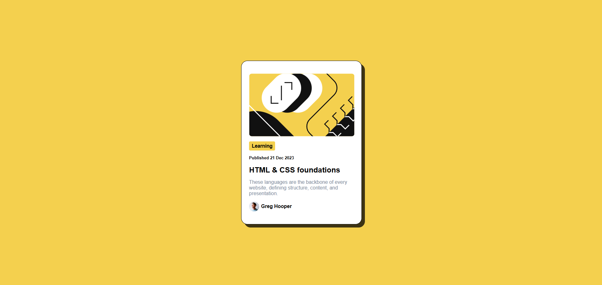

# Frontend Mentor - Blog preview card

## Welcome! 👋

Thanks for checking out this front-end coding challenge.

[Frontend Mentor](https://www.frontendmentor.io) challenges help you improve your coding skills by building realistic projects.

**To do this challenge, you need a basic understanding of HTML and CSS.**

## The challenge

Build the blog preview card to match the design, focusing on accurate layout, typography, and hover/focus states. This challenge will help reinforce your HTML and CSS skills, while adding basic interactivity.

## Where to find everything

Your task is to build out the project to the designs inside the `/design` folder. You will find both a mobile and a desktop version of the design.

The designs are in JPG static format. Using JPGs will mean that you'll need to use your best judgment for styles such as `font-size`, `padding` and `margin`.

If you would like the design files (we provide Sketch & Figma versions) to inspect the design in more detail, you can [subscribe as a PRO member](https://www.frontendmentor.io/pro).

All the required assets for this project are in the `/assets` folder. The images are already exported for the correct screen size and optimized.

We also include variable and static font files for the required fonts for this project. You can choose to either link to Google Fonts or use the local font files to host the fonts yourself. Note that we've removed the static font files for the font weights that aren't needed for this project.

There is also a `style-guide.md` file containing the information you'll need, such as color palette and fonts.
